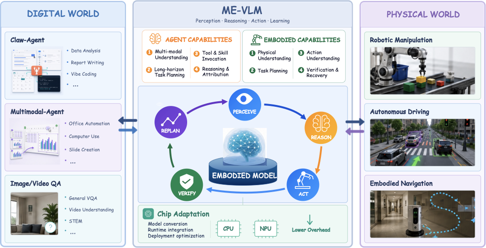

<p>
  
</p>

<h3 align="center">ME-VLM: A Unified VLM for Embodied Cognition and Agent Coordination</h3>

<p align="center">
  <a href="https://arxiv.org/abs/2609.24526"></a>
  &nbsp;
  <a href="assets/ME-VLM.pdf"></a>
  &nbsp;
  <a href="https://machembodied.com/ME-Brain/ME-VLM.html"></a>
</p>

## About

**ME-VLM (MachEmbodied-VLM)** is a unified vision-language model with two variants, **4B** and **35B-A3B**, that brings together **embodied cognition** and **multimodal agent capabilities** for Physical AI.

Physical AI requires models to ground visual and linguistic understanding in real-world environments while accounting for environmental constraints and execution feedback. ME-VLM is built around two synergistic core capabilities:

- **Embodied cognition:** perceive, understand, and reason about physical environments — strengthened geometric perception of physical elements and space, modeling of temporal action sequences, and modeling of execution feedback.
- **Agent capability:** building on the enhanced spatial, temporal, and dynamics awareness — long-horizon autonomous planning, skill and tool invocation, and reflection with failure attribution, forming a closed loop from perception and planning to action execution, feedback, and correction.

Unlike existing pipelines that simply cascade a planner and executors, ME-VLM adopts a unified modeling approach in which embodied cognition and agentic decisions mutually constrain each other: perception of the physical environment grounds task planning and skill selection, while physical states observed during execution in turn steer the model's attention toward relevant objects and regions and inform its subsequent decisions.



## Highlights

- **Unified training data and a joint training pipeline.** Training data spanning embodied and multimodal-agent tasks, including execution observations and feedback to support outcome assessment and decision refinement. The pipeline comprises **embodied capability injection** (two-stage SFT), **separate reinforcement learning** of embodied and multimodal-agent experts, and **multi-teacher on-policy distillation** that consolidates their complementary capabilities into a single model.
- **Competitive performance across embodied and agent benchmarks.** ME-VLM 35B-A3B achieves the highest average score on 26 embodied benchmarks (physical understanding, task planning, action execution, error correction) and on a broad suite of agent benchmarks (multimodal understanding, tool/skill invocation, long-horizon planning, reasoning, instruction following).
- **Cross-task generalization.** The learned embodied capabilities transfer to **autonomous driving** and **embodied navigation** (R2R / RxR) through lightweight domain adaptation.
- **Edge deployment.** Visual token compression (training-free, plug-and-play Max–Min diversity selection), **W4A8 quantization**, and hardware–software co-optimization enable on-device inference of the 4B variant on the **M100** NPU, reducing prefill latency from 400 ms to 188 ms with controlled accuracy degradation.

## Applications

ME-VLM grounds instructions in physical scenes, organizes multi-step actions, incorporates execution feedback, and produces verifiable task outcomes across:

- Autonomous driving
- Embodied navigation
- Embodied task execution
- Digital tool use and closed-loop interaction

For qualitative cases, visit our [Project Page](https://machembodied.com/ME-Brain/ME-VLM.html).

## News

- **2026-09-22:** Released the ME-VLM technical report.

## Todo

- [x] Technical report.
- [ ] Inference code.
- [ ] Training code.
- [ ] Pretrained model weights (4B / 35B-A3B).
- [ ] Edge deployment toolkit (visual token compression + W4A8 quantization).

## Citation

```bibtex
```

## License

ME-VLM is licensed under the [Apache License 2.0](LICENSE).
Third-party dependencies, model weights, and datasets remain subject
to their respective licenses.
